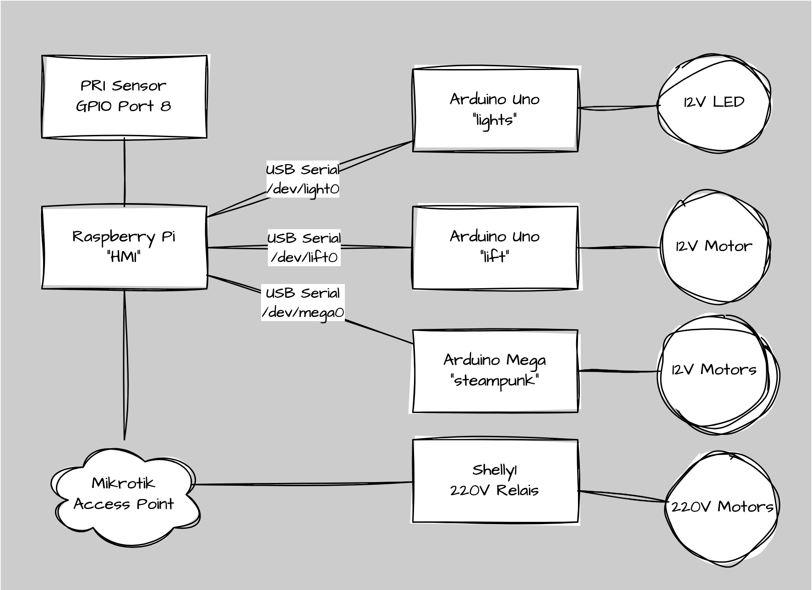
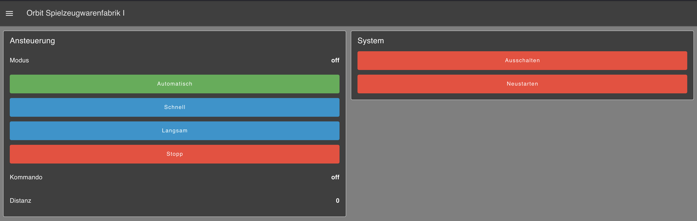

# Orbit Adventsfenster

Das Projekt "Orbit Adventsfenster" ist ein interaktives Beleuchtungssystem, das speziell für die Adventszeit entwickelt wurde. Es besteht aus mehreren Komponenten, die zusammenarbeiten, um eine festliche Lichtshow zu erzeugen.

## Systemübersicht

## Komponenten
Orbit Lift
Der Orbit Lift ist für die Bewegung der Lichter zuständig. Er steuert die Positionierung der Lichter und sorgt dafür, dass sie sich synchron zur Musik bewegen.

### Orbit Lights
Die Orbit Lights steuern die Beleuchtungseffekte. Sie sind für die verschiedenen Lichtmuster und Farben verantwortlich, die während der Show angezeigt werden.

### Orbit Node-RED
Der Orbit Node-RED ist das Steuerungssystem des Projekts. Es verwendet Node-RED, um die verschiedenen Komponenten zu steuern und zu synchronisieren. Die Konfigurationsdateien und Skripte befinden sich in diesem Verzeichnis.

- commands.md: Dokumentation der verfügbaren Befehle.
- flows.json: Node-RED Flows zur Steuerung des Systems.
- states.js: JavaScript-Datei zur Verwaltung der Zustände.
- tfminiparser.js: Parser für die TFMini-Sensoren.

### Orbit Steampunk
Der Orbit Steampunk ist eine alternative Version des Projekts mit einem Steampunk-Thema. Er verwendet ähnliche Komponenten, jedoch mit einem anderen Design und anderen Effekten.

## Benutzeroberfläche

Die Benutzeroberfläche ermöglicht es den Benutzern, die verschiedenen Lichteffekte und Bewegungen zu steuern. Sie bietet eine einfache Möglichkeit, das System zu konfigurieren und anzupassen.

Installation und Einrichtung
Klone das Repository auf deinen lokalen Rechner.
Installiere die erforderlichen Abhängigkeiten und Bibliotheken.
Lade die .ino-Dateien auf die entsprechenden Mikrocontroller hoch.
Starte Node-RED und importiere die Flows aus der flows.json Datei.
Konfiguriere die Hardware gemäss der Systemübersicht.

Diese Dokumentation bietet einen Überblick über das Projekt und seine Komponenten. Weitere Details und Anleitungen findest du in den jeweiligen Verzeichnissen und Dateien.